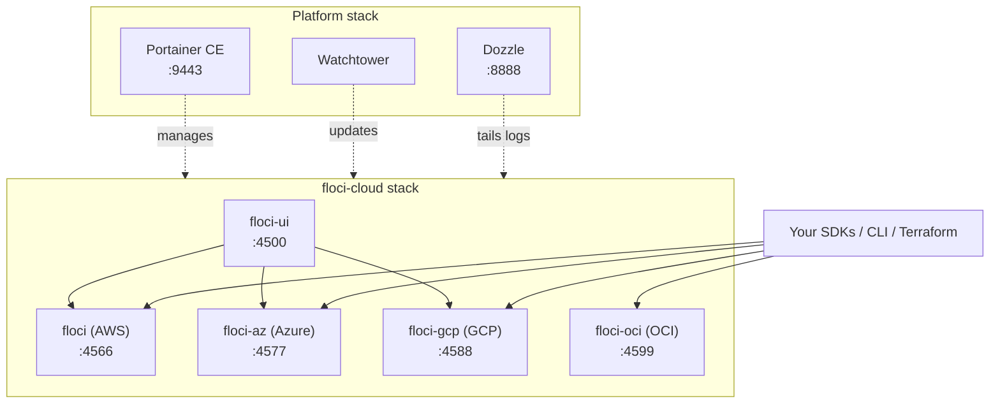

# Floci Multi-Cloud Lab — Portainer, Watchtower & Dozzle (Debian)

A step-by-step guide to running an all-in-one **local multi-cloud emulation lab** on Debian using
[Floci](https://floci.io/) (AWS, Azure, GCP, OCI), with **Portainer CE** for container management,
**Watchtower** for automatic updates, and **Dozzle** for live log streaming.

> **Unofficial.** This is a personal setup guide, not a Floci project. Floci itself lives at
> [floci.io](https://floci.io/) and [github.com/floci-io](https://github.com/floci-io).

This lab is also the foundation for **FlociLab** — a .NET sample for every service these emulators
support, built with Blazor and Aspire. See [`docs/BLAZOR-PLAN.md`](docs/BLAZOR-PLAN.md) for the plan
and [`docs/WORKFLOW.md`](docs/WORKFLOW.md) for how the `/next` and `/ship` skills drive it.

---

## Contents

1. [What is Floci?](#1-what-is-floci)
2. [Prerequisites](#2-prerequisites)
3. [Deploy Portainer CE](#3-deploy-portainer-ce)
4. [Stack 1 — Floci multi-cloud suite](#4-stack-1--floci-multi-cloud-suite)
5. [Stack 2 — Platform tools (Watchtower + Dozzle)](#5-stack-2--platform-tools-watchtower--dozzle)
6. [Port reference](#6-port-reference)
7. [Verification](#7-verification)
8. [Security notes](#8-security-notes)
9. [Troubleshooting](#9-troubleshooting)
10. [Teardown](#10-teardown)

---

## 1. What is Floci?

Floci is a family of free, open-source local cloud emulators built as Quarkus native binaries —
one container per cloud, one port each, no account, no auth token, no feature gates. A service
starts in roughly 24 ms and idles at about 13 MiB.

| Emulator | Cloud | Port | Coverage |
| :--- | :--- | :--- | :--- |
| [`floci`](https://github.com/floci-io/floci) | AWS | `4566` | ~75 services — drop-in replacement for LocalStack Community |
| [`floci-az`](https://github.com/floci-io/floci-az) | Azure | `4577` | ~24 services — Blob, Queue, Table, Cosmos, Key Vault, Service Bus, Event Hubs, ARM plane |
| [`floci-gcp`](https://github.com/floci-io/floci-gcp) | GCP | `4588` | ~25 services — GCS, Pub/Sub, Firestore, Secret Manager, Cloud Run, GKE |
| [`floci-oci`](https://github.com/floci-io/floci-oci) | Oracle Cloud | `4599` | ~8 services — Object Storage, Identity, Queue, Streaming, Vault/KMS, Functions, OKE |
| [`floci-ui`](https://github.com/floci-io/floci-ui) | Console | `4500` | Web console for AWS, Azure and GCP |



> **Note on the console:** `floci-ui` supports **AWS, Azure and GCP only**. There is no OCI
> support in the console as of v0.3.0 — the OCI emulator is fully usable, but only through the
> SDK, CLI or Terraform, not through the web UI.

---

## 2. Prerequisites

### 2.1 Docker Engine and Compose plugin

```bash
# Update and install dependencies
sudo apt update
sudo apt install -y ca-certificates curl gnupg lsb-release

# Add Docker's official GPG key
sudo install -m 0755 -d /etc/apt/keyrings
curl -fsSL https://download.docker.com/linux/debian/gpg | sudo gpg --dearmor -o /etc/apt/keyrings/docker.gpg
sudo chmod a+r /etc/apt/keyrings/docker.gpg

# Add the Docker apt repository
echo "deb [arch=$(dpkg --print-architecture) signed-by=/etc/apt/keyrings/docker.gpg] https://download.docker.com/linux/debian $(lsb_release -cs) stable" \
  | sudo tee /etc/apt/sources.list.d/docker.list > /dev/null

# Install Docker Engine and the Compose plugin
sudo apt update
sudo apt install -y docker-ce docker-ce-cli containerd.io docker-buildx-plugin docker-compose-plugin

# Manage Docker as a non-root user
sudo usermod -aG docker "$USER"
newgrp docker
```

### 2.2 AWS CLI (used for verification in section 7)

```bash
sudo apt install -y unzip
curl -fsSL "https://awscli.amazonaws.com/awscli-exe-linux-x86_64.zip" -o awscliv2.zip
unzip -q awscliv2.zip && sudo ./aws/install && rm -rf aws awscliv2.zip
```

Floci accepts **any** non-empty credentials. Create a dedicated profile so you never mix it up
with a real account:

```bash
aws configure set aws_access_key_id     test --profile floci
aws configure set aws_secret_access_key test --profile floci
aws configure set region                us-east-1 --profile floci
```

---

## 3. Deploy Portainer CE

### 3.1 Create the persistent volume

```bash
docker volume create portainer_data
```

### 3.2 Launch Portainer

```bash
docker run -d \
  --name portainer \
  --restart=unless-stopped \
  -p 9443:9443 \
  -p 9000:9000 \
  -v /var/run/docker.sock:/var/run/docker.sock \
  -v portainer_data:/data \
  portainer/portainer-ce:latest
```

### 3.3 Initial configuration

1. Browse to **`https://<DEBIAN_IP>:9443`** (self-signed certificate — accept the warning).
2. Create your **admin username and password**.
3. Choose **Get Started** to manage the local Docker environment.

> ⚠️ **Five-minute timeout.** Portainer disables initial admin setup if you don't create the
> account within 5 minutes of container start. If you see *"instance timed out for security
> purposes"*, run `docker restart portainer` and reload the page.

---

## 4. Stack 1 — Floci multi-cloud suite

In Portainer go to **Stacks → + Add stack**, name it **`floci-cloud`**, choose **Web editor**,
and paste the following.

```yaml
name: floci-cloud

services:
  # =========================================================
  # Web console — serves both the UI and its API on one port.
  # Supports AWS, Azure and GCP. OCI is not wired into the UI.
  # =========================================================
  floci-ui:
    image: floci/floci-ui:latest
    container_name: floci-ui
    restart: unless-stopped
    ports:
      - "4500:4500"
    environment:
      PORT: "4500"
      FLOCI_ENDPOINT: http://floci:4566
      FLOCI_AZURE_ENDPOINT: http://floci-az:4577
      FLOCI_AZURE_ACCOUNT_NAME: devstoreaccount1
      FLOCI_GCP_ENDPOINT: http://floci-gcp:4588
      FLOCI_GCP_PROJECT: floci-local
      AWS_REGION: us-east-1
      AWS_ACCESS_KEY_ID: test
      AWS_SECRET_ACCESS_KEY: test
    depends_on:
      floci:
        condition: service_healthy
      floci-az:
        condition: service_healthy
      floci-gcp:
        condition: service_healthy
    networks:
      - floci

  # =========================================================
  # 1. AWS emulator
  # =========================================================
  floci:
    image: floci/floci:latest
    container_name: floci
    restart: unless-stopped
    ports:
      - "4566:4566"
    environment:
      # Without HOSTNAME the emulator hands back "localhost" URLs
      # (pre-signed S3 links, service endpoints) that are wrong
      # for any other container on this network.
      FLOCI_HOSTNAME: floci
      FLOCI_DEFAULT_REGION: us-east-1
      FLOCI_STORAGE_MODE: persistent
      # Lambda runs in throwaway containers; put them on this
      # network so they can reach the other emulators.
      FLOCI_SERVICES_LAMBDA_DOCKER_NETWORK: floci
    volumes:
      # Lambda, RDS, ECS, EKS, ElastiCache and friends are backed by
      # real containers, so the emulator drives the host Docker daemon.
      - /var/run/docker.sock:/var/run/docker.sock
      - floci_aws:/app/data
    networks:
      floci:
        aliases:
          - localhost.floci.io

  # =========================================================
  # 2. Azure emulator
  # =========================================================
  floci-az:
    image: floci/floci-az:latest
    container_name: floci-az
    restart: unless-stopped
    ports:
      - "4577:4577"   # HTTP control + data plane
      - "5672:5672"   # Event Hubs   (AMQP 1.0)
      - "5673:5673"   # Service Bus  (AMQP 1.0)
      - "9093:9093"   # Event Hubs   (Kafka protocol)
    environment:
      FLOCI_AZ_HOSTNAME: floci-az
      FLOCI_AZ_BASE_URL: http://floci-az:4577
      FLOCI_AZ_STORAGE_MODE: persistent
    volumes:
      # Needed for Functions, Event Hubs / Service Bus sidecars,
      # Cosmos engines, PostgreSQL, Redis, ACR and AKS.
      - /var/run/docker.sock:/var/run/docker.sock
      - floci_az:/app/data
    networks:
      - floci

  # =========================================================
  # 3. GCP emulator
  # =========================================================
  floci-gcp:
    image: floci/floci-gcp:latest
    container_name: floci-gcp
    restart: unless-stopped
    ports:
      - "4588:4588"
    environment:
      FLOCI_GCP_HOSTNAME: floci-gcp
      FLOCI_GCP_BASE_URL: http://floci-gcp:4588
      FLOCI_GCP_DEFAULT_PROJECT_ID: floci-local
      FLOCI_GCP_STORAGE_MODE: persistent
    volumes:
      # Cloud Run, GKE and Cloud SQL are backed by real containers.
      - /var/run/docker.sock:/var/run/docker.sock
      - floci_gcp:/app/data
    networks:
      - floci

  # =========================================================
  # 4. Oracle Cloud (OCI) emulator
  # =========================================================
  floci-oci:
    image: floci/floci-oci:latest
    container_name: floci-oci
    restart: unless-stopped
    ports:
      - "4599:4599"
    environment:
      FLOCI_OCI_HOSTNAME: floci-oci
      FLOCI_OCI_STORAGE_MODE: persistent
    volumes:
      # Needed for Functions (Fn Project sidecar) and OKE (k3s).
      - /var/run/docker.sock:/var/run/docker.sock
      - floci_oci:/app/data
    networks:
      - floci

networks:
  floci:
    name: floci

volumes:
  floci_aws:
  floci_az:
  floci_gcp:
  floci_oci:
```

Click **Deploy the stack**.

### Why these settings matter

| Setting | Reason |
| :--- | :--- |
| `FLOCI_*_STORAGE_MODE: persistent` + volumes | The default is `memory`. Combined with Watchtower restarting containers to apply updates, every bucket, queue and secret would silently disappear on each update. |
| `FLOCI_*_HOSTNAME` | Emulators return absolute URLs (pre-signed S3 links, Blob endpoints, ARM resource URIs). Without this they say `localhost`, which resolves to the wrong container. |
| `/var/run/docker.sock` on **all four** | Lambda, RDS, ECS, EKS, Azure Functions, Cosmos engines, Cloud Run, GKE, OCI Functions and OKE are all backed by real containers. |
| `FLOCI_SERVICES_LAMBDA_DOCKER_NETWORK` | Lambda containers otherwise land on the default bridge and cannot reach S3, SQS or DynamoDB. |
| Named network `floci` | Makes the network name deterministic instead of Portainer's generated `floci-cloud_default`. |
| `depends_on: service_healthy` | The images ship their own `HEALTHCHECK`, so the console waits for real readiness rather than just container start. |
| Ports `5672` / `5673` / `9093` | Event Hubs and Service Bus speak AMQP and Kafka, not HTTP. Without these they are unreachable. |

---

## 5. Stack 2 — Platform tools (Watchtower + Dozzle)

A second stack named **`platform`**, kept separate so updating your tooling never restarts your
emulators mid-experiment.

```yaml
name: platform

services:
  # Automatic container updates
  watchtower:
    image: nickfedor/watchtower:latest
    container_name: watchtower
    restart: unless-stopped
    volumes:
      - /var/run/docker.sock:/var/run/docker.sock
    environment:
      WATCHTOWER_POLL_INTERVAL: "86400"      # every 24 hours
      WATCHTOWER_CLEANUP: "true"             # prune obsolete image layers
      WATCHTOWER_INCLUDE_RESTARTING: "true"
      WATCHTOWER_ROLLING_RESTART: "true"     # one container at a time
      TZ: "America/New_York"

  # Live log viewer for every container
  dozzle:
    image: amir20/dozzle:latest
    container_name: dozzle
    restart: unless-stopped
    ports:
      - "8888:8080"                          # Dozzle listens on 8080 internally
    volumes:
      # Read-only: Dozzle only ever reads logs and container metadata.
      - /var/run/docker.sock:/var/run/docker.sock:ro
    environment:
      DOZZLE_ENABLE_ACTIONS: "true"          # start/stop/restart from the UI
      DOZZLE_HOSTNAME: floci-lab
```

Dozzle earns its place here specifically because Floci logs every unimplemented API call. When an
SDK call fails, tailing all four emulators side by side at
**`http://<DEBIAN_IP>:8888`** is the fastest way to see which service returned `501`.

> `nickfedor/watchtower` is the actively maintained community fork; the original
> `containrrr/watchtower` is no longer updated.

> If you ever expose Dozzle beyond localhost, set `DOZZLE_AUTH_PROVIDER=simple` and mount a
> users file — by default it is unauthenticated.

---

## 6. Port reference

| Service | Port | URL | Consumed by |
| :--- | :--- | :--- | :--- |
| **Portainer** | `9443` / `9000` | `https://<DEBIAN_IP>:9443` | Container management |
| **Dozzle** | `8888` | `http://<DEBIAN_IP>:8888` | Live container logs |
| **Floci console** | `4500` | `http://<DEBIAN_IP>:4500` | Web UI (AWS, Azure, GCP) |
| **AWS emulator** | `4566` | `http://<DEBIAN_IP>:4566` | AWS CLI, boto3, AWS SDKs, Terraform, CDK |
| **Azure emulator** | `4577` | `http://<DEBIAN_IP>:4577` | Azure SDKs, Storage Explorer, `azfloci` |
| ↳ Event Hubs AMQP | `5672` | `amqp://<DEBIAN_IP>:5672` | Event Hubs SDK |
| ↳ Service Bus AMQP | `5673` | `amqp://<DEBIAN_IP>:5673` | Service Bus SDK |
| ↳ Event Hubs Kafka | `9093` | `<DEBIAN_IP>:9093` | Kafka clients |
| **GCP emulator** | `4588` | `http://<DEBIAN_IP>:4588` | `gcloud`, Google client libraries |
| **OCI emulator** | `4599` | `http://<DEBIAN_IP>:4599` | OCI CLI / SDKs / Terraform |

---

## 7. Verification

### 7.1 All containers healthy

```bash
docker compose -p floci-cloud ps
curl -fsS http://localhost:4566/_floci/health && echo " AWS ok"
curl -fsS http://localhost:4577/_floci/health && echo " Azure ok"
curl -fsS http://localhost:4588/_floci-gcp/health && echo " GCP ok"
curl -fsS http://localhost:4599/_floci-oci/health && echo " OCI ok"
```

The health path is not the same on all four images: `floci` and `floci-az` serve `/_floci/health`,
while `floci-gcp` and `floci-oci` namespace theirs and return `404` on `/_floci/health`. Each
image's own `HEALTHCHECK` is the authority — `docker inspect <container> --format
'{{json .Config.Healthcheck}}'` shows the exact URL it polls.

### 7.2 Console

Open **`http://<DEBIAN_IP>:4500`**. You should see the Cloud Explorer with AWS, Azure and GCP.

### 7.3 AWS — create and list a bucket

```bash
aws --profile floci --endpoint-url=http://localhost:4566 s3 mb s3://my-local-bucket
aws --profile floci --endpoint-url=http://localhost:4566 s3 ls
```

### 7.4 Azure — list blob containers

```bash
curl -s "http://localhost:4577/devstoreaccount1?comp=list"
```

### 7.5 GCP — create a bucket

```bash
curl -s -X POST \
  "http://localhost:4588/storage/v1/b?project=floci-local" \
  -H "Content-Type: application/json" \
  -d '{"name":"my-gcs-bucket"}'
```

### 7.6 OCI — get the Object Storage namespace

```bash
curl -s http://localhost:4599/n/
```

### 7.7 Persistence survives a restart

This is the check that proves your storage mode is right:

```bash
docker restart floci
sleep 5
aws --profile floci --endpoint-url=http://localhost:4566 s3 ls   # bucket should still be there
```

### 7.8 Watchtower

```bash
docker logs watchtower --tail 50
```

---

## 8. Security notes

This lab grants broad privileges to make the emulators work. Understand them before exposing
anything.

- **Docker socket access is root-equivalent.** Portainer, Watchtower and all four emulators mount
  `/var/run/docker.sock`. Any of them can start a privileged container on the host. Dozzle is the
  one exception here — it is mounted `:ro`.
- **The emulators have no authentication.** They accept any credentials by design. Anyone who can
  reach ports 4500–4599 has full control of your emulated resources.
- **Do not expose this host to the internet.** Keep it on a trusted LAN, and firewall the ports:

  ```bash
  sudo ufw allow from 192.168.0.0/16 to any port 4500:4599 proto tcp
  sudo ufw deny 4500:4599/tcp
  ```

- **Or bind to localhost only** and reach the box over SSH port-forwarding. Prefix each published
  port in the Compose files, e.g. `"127.0.0.1:4566:4566"`.
- **Never point these emulators at real cloud credentials**, and never reuse the `floci` AWS CLI
  profile for a real account.

---

## 9. Troubleshooting

| Symptom | Cause and fix |
| :--- | :--- |
| Stack fails with *"services must be a mapping"* | YAML indentation. Every service must be indented **two spaces** under `services:`. |
| Portainer: *"instance timed out for security purposes"* | The 5-minute admin-setup window expired. `docker restart portainer`. |
| `Unable to locate credentials` from the AWS CLI | Missing profile. See [2.2](#22-aws-cli-used-for-verification-in-section-7), or export `AWS_ACCESS_KEY_ID=test AWS_SECRET_ACCESS_KEY=test`. |
| Buckets/queues vanish after a day | `STORAGE_MODE` fell back to `memory`, or the named volume is missing. Watchtower restarts the container daily to apply updates. |
| Pre-signed URLs point at `localhost` and 404 | `FLOCI_*_HOSTNAME` not set. |
| `Failed to start Lambda container` | The Docker socket is not mounted on `floci`. |
| Lambda runs but can't reach S3/SQS | `FLOCI_SERVICES_LAMBDA_DOCKER_NETWORK` not set to `floci`. |
| Service Bus / Event Hubs client times out | AMQP ports `5672` / `5673` (or Kafka `9093`) not published. |
| Azure Functions returns `501 NotImplemented` | Known runtime gap in floci-az — the console shows Serverless as "coming soon" for Azure. |
| No OCI resources in the web console | Expected. `floci-ui` has no OCI support; use the OCI CLI or SDK. |
| A service returns `501` | That operation isn't implemented yet. Confirm in Dozzle, then check the upstream service matrix. |

Useful log commands:

```bash
docker logs -f floci        # or use Dozzle at :8888
docker logs -f floci-az
docker inspect --format '{{.State.Health.Status}}' floci
```

---

## 10. Teardown

```bash
# Remove the stacks (Portainer: Stacks -> select -> Remove)
docker compose -p floci-cloud down
docker compose -p platform down

# Remove Portainer itself
docker rm -f portainer

# Delete all persisted emulator state (irreversible)
docker volume rm floci_aws floci_az floci_gcp floci_oci portainer_data

# Reclaim disk from images pulled by the emulators (Lambda runtimes, k3s, Postgres, ...)
docker image prune -a
```

---

## Credits

- [Floci](https://floci.io/) — [floci-io/floci](https://github.com/floci-io/floci) ·
  [floci-az](https://github.com/floci-io/floci-az) ·
  [floci-gcp](https://github.com/floci-io/floci-gcp) ·
  [floci-oci](https://github.com/floci-io/floci-oci) ·
  [floci-ui](https://github.com/floci-io/floci-ui)
- [Portainer CE](https://www.portainer.io/) · [Watchtower](https://github.com/nicholas-fedor/watchtower) · [Dozzle](https://dozzle.dev/)

Licensed under the [MIT License](LICENSE).
