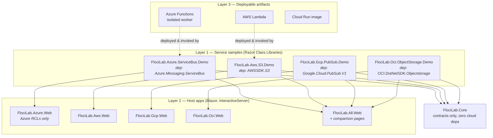

# FlociLab — Blazor + Aspire Multi-Cloud Sample Plan

A living plan and progress tracker for building **one .NET sample per Floci-emulated cloud service**,
composable into per-provider Blazor apps and a unified side-by-side comparison app, orchestrated by
Aspire.

**Status:** Phase 0–1 complete · Phase 2 started · **15 / 136 services** (3 ⊘ — sample and test ship,
the emulator does not implement the service) · **1 / 5 comparison pages**
**Last updated:** 2026-09-01

---

## Contents

- [1. Goals and non-goals](#1-goals-and-non-goals)
- [2. Verified environment](#2-verified-environment)
- [3. Architecture](#3-architecture)
- [4. Project taxonomy](#4-project-taxonomy)
- [5. Repository layout](#5-repository-layout)
- [6. The Core contracts](#6-the-core-contracts)
- [7. Per-provider endpoint configuration](#7-per-provider-endpoint-configuration)
- [8. Side-by-side comparison app](#8-side-by-side-comparison-app)
- [9. Aspire orchestration](#9-aspire-orchestration)
- [10. Testing strategy](#10-testing-strategy)
- [11. Model selection and cost strategy](#11-model-selection-and-cost-strategy)
- [12. Phases](#12-phases)
- [13. Service checklists](#13-service-checklists)
- [14. Risk register](#14-risk-register)

---

## 1. Goals and non-goals

### Goals

1. **A working demo of every service Floci emulates** — all 136 of them, eventually.
2. **Each service sample is independently consumable.** Someone who wants "Azure Service Bus in
   .NET" gets a project whose `.csproj` references exactly one cloud package. No AWS, no GCP, no
   unrelated noise. This is the unit that becomes a blog post or a YouTube video.
3. **Per-provider Blazor apps** — an Azure app with zero AWS/GCP references, and so on.
4. **One unified app with side-by-side comparison pages** — "here is object storage in four clouds,
   same operations, same screen."
5. **A live coverage matrix** — probe every service on startup and render what actually works from
   .NET today, including which ones return `501 NotImplemented`.
6. **Aspire orchestrates everything** — emulators, function hosts and web apps, one `F5`.

### Non-goals

- Reimplementing the Floci web console. It already covers AWS/Azure/GCP browsing well.
- Production-grade cloud abstraction. The comparison layer exists to *teach the differences*, not
  to hide them.
- Supporting real cloud endpoints. Emulator-only, by design.

### Why this is worth doing

Floci's compatibility suite covers Java (1,326 tests), Node (449), Python (311), Go (157) and the
AWS CLI (205). **.NET is not in that matrix.** A `Testcontainers.Floci` package exists and Aspire
hosting is on the roadmap, but the .NET path is comparatively unexercised. Expect to find real
bugs — that discovery is part of the product, and it is the content angle nobody else has.

**OCI is the biggest differentiator:** verified against the shipped `floci-ui` binary, the console
supports `aws`, `azure` and `gcp` only — there is no OCI support at all. OCI samples here are not a
reimplementation of anything.

---

## 2. Verified environment

Everything below was checked against live registries and repos on 2026-08-28.

| Component | Version | Notes |
| :--- | :--- | :--- |
| .NET SDK | `10.0.302` | Installed locally |
| Aspire | `13.5.3` | `Aspire.Hosting.AppHost`, `Aspire.AppHost.Sdk` |
| `Aspire.Hosting.Azure.Functions` | `13.5.3` | For Kind B Azure function projects |
| `Aspire.Hosting.AWS` | `13.7.2` | AWS-flavoured Aspire resources |
| `Testcontainers.Floci` | `4.14.0` | Official .NET Testcontainers module |
| `floci/floci` | `1.7.0` | UBI9-minimal base, ships its own `HEALTHCHECK` |
| `floci/floci-ui` | `0.3.0` | Single combined server on `:4500`; **AWS/Azure/GCP only** |

Emulator endpoints (matching the Compose stack in the [README](../README.md)):

| Cloud | In-container | From host | Health path |
| :--- | :--- | :--- | :--- |
| AWS | `http://floci:4566` | `http://127.0.0.1:4566` | `/_floci/health` |
| Azure | `http://floci-az:4577` (+ AMQP `5672`/`5673`, Kafka `9093`) | `http://127.0.0.1:4577` | `/_floci/health` |
| GCP | `http://floci-gcp:4588` | `http://127.0.0.1:4588` | `/_floci-gcp/health` |
| OCI | `http://floci-oci:4599` | `http://127.0.0.1:4599` | `/_floci-oci/health` |

The health path is **not uniform** — `floci-gcp` and `floci-oci` namespace theirs and return `404`
on `/_floci/health`, so a probe that assumes one path reports two healthy emulators as unreachable.
Each image's own `HEALTHCHECK` is the authority. Related: `floci-az` answers `/_floci-az/health`
with a genuine `501`, which is a useful live example of the outcome the coverage matrix records.

---

## 3. Architecture

The central design tension: **isolated, single-dependency samples** vs. **a unified app that can
compare clouds side by side.** These are usually in conflict. Razor Class Libraries resolve them.



### Key decisions

| Decision | Choice | Rationale |
| :--- | :--- | :--- |
| Render mode | **Blazor Web App, global `InteractiveServer`** | Cloud SDK calls stay server-side. Under WebAssembly you would ship four cloud SDKs to the browser (tens of MB), do SigV4 signing client-side, and fight CORS against emulators that send no CORS headers. Server mode makes all of that a non-issue. |
| Sample unit | **Razor Class Library, one per service** | The RCL carries the page, the components and the client wrapper. Its `.csproj` references exactly one cloud SDK package. That is the blog/video artifact — clonable on its own. |
| Host apps | **Five thin hosts** | Four per-provider + one unified. Each is ~50 lines of `Program.cs` plus nav, because all content lives in the RCLs. Cheap to maintain, and it satisfies "the Azure app has no AWS references". |
| Comparison | **Separate `FlociLab.Comparison` RCL** | Depends only on `FlociLab.Core` capability interfaces, never on provider SDKs. Referenced only by `FlociLab.All.Web`. |
| Cross-cloud coupling | **Capability interfaces in Core** | Provider RCLs opt in by implementing `IObjectStoreCapability` etc. Services with no analog (Textract, Bedrock) simply don't implement one and don't appear in comparison. |
| .NET version | **`net10.0`** | Matches the installed SDK. |

### Why RCLs specifically

A Razor Class Library compiles pages, components, CSS and static assets into a single package.
Static assets are served automatically from `_content/{AssemblyName}/`. So:

- `FlociLab.Azure.ServiceBus.Demo` alone → clone the folder, `dotnet run` a 20-line host, you have a
  Service Bus demo with one NuGet dependency. **That is the blog post.**
- The same RCL, referenced by `FlociLab.All.Web` → appears in the unified nav next to 135 others.

One implementation, two audiences, no duplication.

---

## 4. Project taxonomy

Not every service can be a Blazor page. Three kinds:

### Kind A — RCL demo (majority)

A Razor Class Library with a demo page and a thin client wrapper. Covers anything with a
request/response API surface: S3, SQS, DynamoDB, Blob, Cosmos, Key Vault, Pub/Sub, Firestore,
Object Storage, Vault, and so on.

```
samples/azure/servicebus/FlociLab.Azure.ServiceBus.Demo/
├── FlociLab.Azure.ServiceBus.Demo.csproj   # ONE official cloud package
├── ServiceBusDemo.cs                       # IServiceDemo implementation
├── ServiceBusClientFactory.cs              # endpoint wiring
├── Pages/ServiceBusPage.razor              # the UI
└── ServiceCollectionExtensions.cs          # AddServiceBusDemo()
```

### Kind B — deployable artifact + companion RCL

Serverless and container workloads can't be a Razor page — they are **separate deployable
projects** that get built, packaged and pushed *into* the emulator. Each pairs with a Kind A RCL
that deploys it, invokes it and renders the result.

| Cloud | Artifact project type | Emulator target |
| :--- | :--- | :--- |
| AWS | Lambda (`Amazon.Lambda.RuntimeSupport`), ECS/EKS container image | Lambda, ECS, EKS, Batch, CodeBuild |
| Azure | Isolated-worker Functions, ACI/AKS image | Functions, ACI, AKS, ACR |
| GCP | Cloud Run container, Cloud Functions source zip | Cloud Run, Cloud Functions, GKE |
| OCI | Fn Project function image | Functions, OKE |

```
functions/azure/FlociLab.Azure.Functions.OrderProcessor/   # Kind B artifact (a real function app)
samples/azure/functions/FlociLab.Azure.Functions.Demo/     # Kind A RCL that deploys + invokes it
```

> **Known gap:** floci-az returns `501 NotImplemented` for Azure Functions today. Build the
> artifact project anyway — the RCL page should surface the `501` honestly via the coverage matrix
> rather than pretending. It will start working when upstream ships it.

### Kind C — infrastructure-only

No interactive workload; the page runs a scripted provisioning sequence and renders the resulting
resource tree. Covers CloudFormation, Cloud Control API, IAM, Organizations, VNet, Service Quotas,
Resource Groups Tagging, Service Usage.

---

## 5. Repository layout

```
floci/
├── README.md                       # the Docker/Portainer lab (done)
├── docs/BLAZOR-PLAN.md             # this file
├── docs/RCL-TEMPLATE.md            # file-by-file skeleton behind every Kind A sample
├── docs/WORKFLOW.md                # the /next -> /ship loop
├── FlociLab.slnx                   # slnx, the SDK's current default solution format
├── Directory.Build.props           # net10.0, nullable, warnaserror
├── Directory.Packages.props        # central package management — pins every SDK version
├── src/
│   ├── FlociLab.Core/              # contracts ONLY. zero cloud dependencies.
│   ├── FlociLab.Aws.Endpoints/     # endpoint wiring in SDK terms — AWSSDK.Core
│   ├── FlociLab.Azure.Endpoints/   #   ″   — Azure.Identity
│   ├── FlociLab.Gcp.Endpoints/     #   ″   — Google.Api.Gax.Grpc
│   ├── FlociLab.Oci.Endpoints/     #   ″   — OCI.DotNetSDK.Common
│   ├── FlociLab.Comparison/        # RCL: side-by-side pages, Core-only deps
│   └── FlociLab.AppHost/           # Aspire orchestration
├── hosts/
│   ├── FlociLab.Aws.Web/
│   ├── FlociLab.Azure.Web/
│   ├── FlociLab.Gcp.Web/
│   ├── FlociLab.Oci.Web/
│   └── FlociLab.All.Web/           # unified + comparison
├── samples/
│   ├── aws/{s3,sqs,dynamodb,...}/  # Kind A RCLs
│   ├── azure/{blob,servicebus,...}/
│   ├── gcp/{gcs,pubsub,...}/
│   └── oci/{objectstorage,vault,...}/
├── functions/                      # Kind B deployable artifacts
│   ├── aws/, azure/, gcp/, oci/
└── tests/
    └── FlociLab.IntegrationTests/  # Testcontainers.Floci
```

**The four `*.Endpoints` projects** exist because the wiring in §7 is expressed in SDK types —
`ClientConfig`, `TokenCredential`, `ClientBuilderBase<T>`, `IBasicAuthenticationDetailsProvider` —
and `FlociLab.Core` may never reference a cloud package. Each depends on exactly one *.Core-style
package that every sample for that provider already pulls in transitively, so a sample gains no
dependency it did not already have, and the endpoint story is written and fixed once per provider
rather than 82 times. Core keeps what needs no SDK: `FlociOptions` and the plain-value resolvers.

**Central Package Management** (`Directory.Packages.props`) is non-negotiable here. With 136
projects each pulling a different cloud SDK, per-project version pinning becomes unmanageable
within a month.

---

## 6. The Core contracts

`FlociLab.Core` has **zero cloud dependencies**. This is what keeps samples isolated.

```csharp
namespace FlociLab.Core;

/// Every service sample implements this. One per emulated service.
public interface IServiceDemo
{
    /// "aws" | "azure" | "gcp" | "oci"
    string Provider { get; }
    /// Stable slug used in routes: "s3", "servicebus", "pubsub"
    string Slug { get; }
    string DisplayName { get; }
    /// "Storage" | "Messaging" | "Compute" | "Security" | ...
    string Category { get; }
    /// Route into the owning RCL page, e.g. "/azure/servicebus"
    string Route { get; }

    /// Cheapest possible list/describe call. Drives the coverage matrix.
    /// MUST distinguish NotImplemented (501) from Unreachable from Ok.
    Task<ProbeResult> ProbeAsync(CancellationToken ct);

    /// Scripted create -> read -> delete round-trip. Every step logged.
    IAsyncEnumerable<DemoStep> RunAsync(CancellationToken ct);
}

public enum ProbeStatus { Ok, NotImplemented, Unreachable, Error }

public sealed record ProbeResult(
    ProbeStatus Status,
    string? Detail = null,
    TimeSpan? Duration = null);

public sealed record DemoStep(
    string Title,
    string? Request  = null,   // raw HTTP / SDK call shown in the UI
    string? Response = null,
    bool Succeeded   = true,
    string? Error    = null);
```

Capability interfaces — implemented **only** where a genuine cross-cloud analog exists. These are
what the comparison pages consume:

```csharp
public interface IObjectStoreCapability   // S3 / Blob / GCS / OCI Object Storage
{
    Task<IReadOnlyList<ContainerInfo>> ListContainersAsync(CancellationToken ct);
    Task CreateContainerAsync(string name, CancellationToken ct);
    Task PutObjectAsync(string container, string key, Stream data, CancellationToken ct);
    Task<Stream> GetObjectAsync(string container, string key, CancellationToken ct);
    Task DeleteContainerAsync(string name, CancellationToken ct);
}

public interface IQueueCapability          // SQS / Azure Queue+Service Bus / Pub/Sub / OCI Queue
public interface ISecretStoreCapability    // Secrets Manager / Key Vault / Secret Manager / Vault
public interface IDocumentDbCapability     // DynamoDB / Cosmos / Firestore
public interface IKeyManagementCapability  // KMS / Key Vault keys / Cloud KMS / OCI KMS
```

An RCL's page is not routable just because the host references the project. In a Blazor Web App
the endpoint route table is built at startup by `MapRazorComponents<App>()`, and the `Router`
component does the routing that happens inside the interactive circuit — **both** have to be told
about the sample assembly, or the page 404s on a fresh request or dead-ends on an in-app link.
Hosts get the list from `IDemoCatalog.PageAssemblies` rather than naming assemblies by hand, so
routes arrive with the same single `Add*Demo()` call that registers the demo. Verified against
`FlociLab.Aws.S3.Demo`, 2026-08-29.

Registration is one line per sample, and hosts compose them:

```csharp
// FlociLab.Azure.Web/Program.cs — no AWS/GCP/OCI packages anywhere in this project
builder.Services
    .AddFlociCore()
    .AddAzureBlobDemo()
    .AddAzureServiceBusDemo()
    .AddAzureCosmosDbDemo();
```

---

## 7. Per-provider endpoint configuration

This is where most of the real effort lives. Difficulty is **not** uniform.

### AWS — easy

Every `Amazon*Config` exposes `ServiceURL`. One extension in `FlociLab.Aws.Endpoints` covers all
82 services.

```csharp
// FlociLab.Aws.Endpoints
public static TConfig ForFloci<TConfig>(this TConfig config, AwsEndpoints endpoints)
    where TConfig : ClientConfig
{
    config.ServiceURL = endpoints.ServiceUrl;            // http://floci:4566
    config.AuthenticationRegion = endpoints.Region;
    config.UseHttp = endpoints.UseHttp;
    return config;
}

// ...so a sample's client factory is two lines:
var config = new AmazonS3Config { ForcePathStyle = true }.ForFloci(endpoints);  // S3 only knob
return new AmazonS3Client(endpoints.Credentials(), config);                     // test/test
```

### OCI — easy to sign, and the one endpoint that fails *silently*

Signatures are **parsed but never verified**, so generate a throwaway RSA key at startup rather
than shipping one.

```csharp
ObjectStorageClient client = new(endpoints.AuthenticationProvider());  // FlociLab.Oci.Endpoints
client.ForFloci(endpoints);                                           //   ″
```

Needs a well-formed config profile (tenancy/user/fingerprint OCIDs), which
`AuthenticationProvider()` builds from the generated key — `Oci.Common.Auth.PrivateKeySupplier`
takes the PEM content directly, so nothing is written to disk. The image issues **no** tenancy OCID
of its own and sets no `FLOCI_OCI_DEFAULT_TENANCY_ID` unless you do, so the lab supplies a
synthetic one (`OciEmulatorOptions.DefaultTenancyId`) and the AppHost passes the same value to the
container. Buckets live in a **compartment**, and the tenancy OCID is the root compartment's, which
is why one value serves both.

> **`client.SetEndpoint(...)` is not enough, and this one bites hardest of the four.** Settled in
> Phase 1 against OCI.DotNetSDK 145.0.0. `RegionalClientBase`'s constructor requires a region on
> the credential — it `NullReference`s without one — and builds a *realm-specific endpoint
> template* from it. Every operation resolves its URI from that template, not from the endpoint.
> So `SetEndpoint` is ignored, `GetEndpoint()` goes on reporting the emulator address you set, and
> **the request goes to real Oracle Cloud**: a client configured for `http://127.0.0.1:1` spent
> 2.0 s reaching Ashburn and came back with a genuine 401 and an `iad-1:`-prefixed
> opc-request-id, while floci-oci's log stayed empty. `UseRealmSpecificEndpointTemplate(false)`
> does not help. `ForFloci` sets **both** the endpoint and the template, which is why samples call
> it rather than `SetEndpoint`. Pinned by `OciObjectStorageTests.SetEndpoint_Alone_Does_Not_Reach_The_Emulator`.

Another naming trap worth knowing before reading a sample: the SDK's operations have **no `Async`
suffix** — `client.GetNamespace(...)`, `client.PutObject(...)` — and return `Task<T>` anyway.
Nothing can be addressed at all until `GetNamespace` has told you the tenancy's Object Storage
namespace, which is looked up rather than configured.

### Azure — medium

No single knob; three distinct planes.

- **Storage (Blob/Queue/Table):** connection string with explicit per-service endpoints. Default
  account `devstoreaccount1` with the well-known Azurite key. **The endpoint host must be an IPv4
  literal**, which is why `AzureEndpoints.StorageRoot` rewrites it — Azure.Storage reads the
  account out of the URL path only for a literal address, and against a DNS name (`localhost`,
  `floci-az`) it assumes the production shape where the account is a subdomain and the first path
  segment is the container. The failure is quiet and misleading: `CreateContainer` returns 201,
  then the upload 404s with `ContainerNotFound`, because the SDK sent it to
  `/devstoreaccount1/hello.txt`. Verified on Azure.Storage.Blobs 12.29.2 (§14).
- **ARM plane (VM, VNet, AKS, ACR, Redis, ACI, Event Grid, Monitor):** `ArmClient` with
  `ArmClientOptions.Environment` pointed at the emulator.
- **Data plane (Key Vault, App Configuration, Cosmos, Service Bus, Event Hubs):** each takes a URI
  in its constructor.

**Credential:** don't hand-roll a fake `TokenCredential`. floci-az implements the **IMDS token
endpoint** and signs real v1.0 JWTs verifiable via JWKS — point `ManagedIdentityCredential` at it
via `FlociLab.Azure.Endpoints`:

```
AZURE_POD_IDENTITY_AUTHORITY_HOST=http://floci-az:4577
```

A **host**, not a URL. Azure.Identity appends `/metadata/identity/oauth2/token` itself; the
full-URL form was the older `AZURE_POD_IDENTITY_TOKEN_URL` variable and is silently ignored now.
Verified end to end on Azure.Identity 1.21.0 against floci-az: `GetTokenAsync` returns a real
signed JWT. The parameterless `ManagedIdentityCredential()` constructor is obsolete — pass
`new ManagedIdentityCredentialOptions()`.

**Messaging:** Service Bus and Event Hubs need `ServiceBusTransportType.AmqpTcp` and the AMQP
ports (`5673` / `5672`), not the HTTP port.

If an SDK refuses plain HTTP, enable TLS with `FLOCI_AZ_TLS_ENABLED=true` and fetch the generated
cert from `GET /_floci/tls-cert`.

### GCP — hardest, and the main technical risk

Three separate problems:

1. **Emulator detection works for some clients only.** Pub/Sub, Firestore and Datastore honour
   `EmulatorDetection.EmulatorOnly` plus `PUBSUB_EMULATOR_HOST` / `FIRESTORE_EMULATOR_HOST`.
2. **`Google.Cloud.Storage.V1` is REST/JSON — and it is the easy one.** Settled in Phase 1
   against 4.15.0; the warnings below were wrong on both counts.
   `StorageClientBuilder { BaseUri = "http://floci-gcp:4588/storage/v1/", UnauthenticatedAccess = true }`
   works, so there is no `HttpClient` fallback to budget for. `STORAGE_EMULATOR_HOST` is *not*
   ignored either: the builder carries an `EmulatorDetection` property, and `EmulatorOnly` plus
   that variable reaches the emulator on all three host spellings. Samples still take the `BaseUri`
   route — a web app that binds its endpoint from configuration should not depend on a
   process-wide environment variable — but both work, and `GcpStorageTests` pins each. Note this
   is the one Google service with no gRPC anywhere in its dependency tree, which is why it dodges
   problems 1 and 3 entirely; do not read its easiness as a forecast for Pub/Sub or Firestore.
3. **Everything is multiplexed on port 4588 via HTTP/2 ALPN.** gRPC clients need
   `ChannelCredentials.Insecure` and an explicit `GrpcAdapter`; some services route by
   `Host` header (`container.*` for GKE) or path prefix (`/container/v1`).
   **Settled for plain gRPC in Phase 2** against Pub/Sub (Google.Cloud.PubSub.V1 3.37.0, GAX
   4.15.0, floci-gcp 0.7.0): the three lines `ForFloci` sets are the whole story, and neither the
   multiplexing nor the ALPN handshake needed a workaround — see the retired row in §14. Take that
   as proof of the *transport* only. The `Host`-header and path-prefix routing above is still
   unproven, and the sample that first needs it should probe before writing code, not assume
   Pub/Sub's ease carries over — the same mistake item 2 warns about for Storage.

`FlociLab.Gcp.Endpoints` holds both routes, and they are mutually exclusive: `builder.ForFloci(…)`
sets endpoint + insecure credentials + adapter for an ordinary gRPC client, while an emulator-aware
client gets `UseEmulatorHost(…)` plus `EmulatorDetection.EmulatorOnly` and **no** explicit endpoint.

Phase 1 exists specifically to hit all four of these problems in week one.

### Configuration binding

One options class, bound from `appsettings.Development.json`, overridable by environment so the
same build runs on the host or inside the Compose network:

```json
{
  "Floci": {
    "Aws":   { "Endpoint": "http://127.0.0.1:4566", "Region": "us-east-1" },
    "Azure": { "Endpoint": "http://127.0.0.1:4577", "AccountName": "devstoreaccount1" },
    "Gcp":   { "Endpoint": "http://127.0.0.1:4588", "ProjectId": "floci-local" },
    "Oci":   { "Endpoint": "http://127.0.0.1:4599" }
  }
}
```

### 7.9 Targeting real cloud

Every sample can run against the real provider as well as the emulator. `UseEmulator` on each
provider's options defaults to **`true`**, so nothing bills by accident and the app still starts
with no configuration; setting it to `false` makes the factory build the client the production way.

This exists because the series' headline claim — *this is ordinary SDK code you could ship* — was
not actually checkable before, and was overstated in three scripts. The emulator knobs were
unconditional, and two of them are **wrong** against real cloud rather than merely redundant:

| Provider | Emulator-only configuration | Why real cloud cannot just reuse it |
| :--- | :--- | :--- |
| AWS | `ServiceURL` · `ForcePathStyle = true` · `MaxErrorRetry = 0` · static `test`/`test` credentials | Real S3 addresses new buckets as a subdomain; forcing path style is deprecated, not merely unnecessary. The static credentials are rejected. |
| Azure | emulator connection string · `MaxRetries = 0` · the `StorageRoot` IPv4 rewrite | The rewrite exists only for the emulator's path-style account, and the well-known Azurite key is not a real credential. |
| GCP | `BaseUri` · `UnauthenticatedAccess = true` | `UnauthenticatedAccess` stops the client looking for the credentials it now genuinely needs. |

So the branch is a real fork, not the same call with the endpoint blanked out. What is identical
either way is everything downstream — the demo, the capability, the page. That is the claim, and it
is now demonstrable rather than asserted.

**Credentials.** AWS and GCP fall back to their own ambient chains (profile/SSO/IMDS, and ADC).
Azure storage is the exception: it authenticates with an account key rather than a `TokenCredential`,
so real-cloud mode needs `Floci:Azure:ConnectionString` supplied. Reaching for
`DefaultAzureCredential` would mean adding `Azure.Identity` and breaking constraint 1, which is not
a trade worth making. It throws at construction if the flag is false and no connection string is
configured, rather than quietly addressing `devstoreaccount1` against a real endpoint.

> **Never put a real connection string in `appsettings*.json`.** User secrets or an environment
> variable only. `appsettings.RealCloud.json` is committed and deliberately contains no secret.

**Running both at once.** The `realcloud` launch profile runs the same binary on `:5116` under the
`RealCloud` environment, so the emulator instance on `:5115` and the real-cloud one can sit side by
side on screen. Each page's fact list leads with a **Target** row — muted for the emulator, red for
real cloud — which is the one fact that has to be readable off a paused frame, and the one a
presenter needs to notice before clicking Run on an account that bills.

**Testing.** CI stays emulator-only and needs no secrets: nothing in the suite sets the flag.
`TargetSelectionTests` pins the safe default in both the options and the three factories, plus the
Azure throw. Real-cloud verification is a manual run per episode, recorded in that episode's claims
table in `../floci-content` with a date — the same table that already carries every other claim.

---

## 8. Side-by-side comparison app

`FlociLab.Comparison` is an RCL referenced only by `FlociLab.All.Web`. It depends on
`FlociLab.Core` and **nothing else** — it discovers providers through DI.

```csharp
@inject IEnumerable<IObjectStoreCapability> Stores
// renders one column per registered provider, N columns wide
```

Two things the object-storage page settled for the four that follow it:

- **A host declares the RCL's routes with `AddComparisonPages()`.** The RCL registers no
  `IServiceDemo`, so nothing else can tell the catalog it owns pages — see §14's retired
  `SampleAssemblies()` row for the failure this avoids.
- **The page cannot classify an SDK exception, so it asks the capability to.**
  `ICloudCapability.Classify(Exception)` returns a `ProbeStatus`, and every implementation
  delegates to the same classifier its demo's probe uses. Without it a documented `501` would
  render identically to a genuine break, and `/coverage` and the comparison page could disagree
  about the same operation.

Planned comparison pages:

| Page | Capability | Providers |
| :--- | :--- | :--- |
| Object storage | `IObjectStoreCapability` | S3 · Blob · GCS · OCI Object Storage |
| Queues | `IQueueCapability` | SQS · Queue Storage + Service Bus · Pub/Sub · OCI Queue |
| Secrets | `ISecretStoreCapability` | Secrets Manager · Key Vault · Secret Manager · OCI Vault |
| Document DB | `IDocumentDbCapability` | DynamoDB · Cosmos NoSQL · Firestore | *(no OCI analog)* |
| Key management | `IKeyManagementCapability` | KMS · Key Vault keys · Cloud KMS · OCI KMS |

Each page runs **the same logical operation** across every provider simultaneously and shows, per
column: the .NET code, the raw wire request, the response, and elapsed time. That last part —
identical operation, four SDKs, four wire formats, one screen — is the thing that doesn't exist
anywhere else and is the strongest content hook.

**Coverage matrix page** (`/coverage`) is the other unified-app-only feature: calls `ProbeAsync`
on all 136 demos in parallel and renders a live grid of Ok / NotImplemented / Unreachable. It is
useful from day one, before a single demo is written, and it is how the checklists in section 13
stay honest.

---

## 9. Aspire orchestration

`Aspire.Hosting.Floci` does not exist yet ([upstream issue #1242](https://github.com/floci-io/floci/issues/1242)),
so write a small extension over `AddContainer`. The emulator images ship their own `HEALTHCHECK`,
so Aspire's readiness gating works without extra configuration.

```csharp
var builder = DistributedApplication.CreateBuilder(args);

EnsureNetwork("floci");   // see "Sibling containers" below

var aws = builder.AddContainer("floci", "floci/floci", "latest")
    .WithHttpEndpoint(port: 4566, targetPort: 4566, name: "http")
    .WithEnvironment("FLOCI_HOSTNAME", "floci")
    .WithEnvironment("FLOCI_STORAGE_MODE", "persistent")
    .WithEnvironment("FLOCI_SERVICES_LAMBDA_DOCKER_NETWORK", "floci")
    .WithContainerNetworkAlias("localhost.floci.io")
    .WithDockerSocket()                                  // -v, not WithBindMount — see below
    .WithSharedNetwork("floci", "floci", "localhost.floci.io")
    .WithHttpHealthCheck("/_floci/health", endpointName: "http")
    .WithLifetime(ContainerLifetime.Persistent);

// ... floci-az, floci-gcp, floci-oci the same way, with their own health paths ...

builder.AddProject<Projects.FlociLab_All_Web>("all")
       // Bound by FlociOptions rather than service discovery, so the same build runs on the host
       // and inside the Compose network.
       .WithEnvironment("Floci__Aws__Endpoint", aws.GetEndpoint("http"))
       .WithEnvironment("AZURE_POD_IDENTITY_AUTHORITY_HOST", az.GetEndpoint("http"))
       .WaitFor(aws).WaitFor(az).WaitFor(gcp).WaitFor(oci);

builder.Build().Run();
```

`floci-ui` joins the same AppHost, so `dotnet run` also brings up the web console on `:4500`. It
is a *client* of three emulators rather than one itself: it reaches them by container name over the
app network, waits on their health checks, and has no OCI support, which is why `floci-oci` is not
among its `WaitFor`s. It is also the one image with no `HEALTHCHECK` of its own, so Aspire polls
`/` for it.

**The Docker socket is a runtime arg, not a bind mount.** `/var/run/docker.sock` is not a host
filesystem path on Windows; `WithBindMount` makes its source absolute against the AppHost folder
and produces a nonsense path. `WithContainerRuntimeArgs("-v", "/var/run/docker.sock:…")` hands it
to the daemon untouched.

**Sibling containers need a network whose name can be written down.** Emulator-to-emulator DNS is
free — Aspire aliases every container by resource name, so `http://floci-az:4577` resolves from
inside `floci` (verified). But Lambda, Functions, Cloud Run and Fn containers are started *by the
emulators* and land on the network named in `FLOCI_SERVICES_LAMBDA_DOCKER_NETWORK`, which has to be
known before the emulator starts. Aspire's own network is
`aspire-persistent-network-<hash>-<apphost>`, generated per machine. So the AppHost creates a
second network called `floci` — the same name the README's Compose stack uses — and joins every
emulator to it with `--network name=floci,alias=<resource>`; without the alias the container is
only known there by its generated name. Verified from a throwaway container on that network: all
four emulators, plus `localhost.floci.io`, resolve.

What Aspire buys beyond convenience:

- **OpenTelemetry traces of every SDK call** in the dashboard. When a GCP gRPC call fails against
  port 4588, the trace shows the actual request. This is worth more than any individual demo page.
- **`WaitFor` on real health checks**, so no start-order races.
- **One `F5`** launches four emulators, five web apps and the function hosts.
- Later: `Aspire.Hosting.Azure.Functions` (13.5.3) hosts the Kind B Azure function projects, and
  `Aspire.Hosting.AWS` (13.7.2) does the same for Lambda.

---

## 10. Testing strategy

Every sample ships one integration test using `Testcontainers.Floci` (4.14.0) — a throwaway
emulator per test class, so CI needs no running stack.

```csharp
[Fact]
public async Task ServiceBus_RoundTrip_Succeeds()
{
    await using var floci = new FlociAzBuilder().Build();
    await floci.StartAsync();
    var demo = new ServiceBusDemo(floci.GetEndpoint());

    var steps = await demo.RunAsync(default).ToListAsync();

    Assert.All(steps, s => Assert.True(s.Succeeded, s.Error));
}
```

`Testcontainers.Floci` 4.14.0 defaults to `floci/floci:1.5.13` and has deprecated its
parameterless `FlociBuilder()` constructor, so pass the image explicitly:
`new FlociBuilder("floci/floci:latest")`. A suite that tests an older build than the AppHost runs
is not the tripwire the checklists need it to be. There is no Testcontainers module for `floci-az`,
`floci-gcp` or `floci-oci` — those three need a plain `ContainerBuilder`, which Phase 1 will settle.

Rules:

- A demo is **not** checked off in section 13 until its integration test passes.
- Probe tests are allowed to assert `NotImplemented` — that is a legitimate, documented outcome
  (Azure Functions today). Assert the *expected* status, so the test fails loudly when upstream
  starts implementing it. That is how the coverage matrix stays truthful.
- Kind B artifacts get a build-and-deploy test, not just an invoke test.

---

## 11. Model selection and cost strategy

You review with Opus before merge, so the goal is to get each PR to *reviewable* quality as
cheaply as possible.

| Work | Model | Why |
| :--- | :--- | :--- |
| **Phase 0**: Core contracts, capability interfaces, the four endpoint factories, Aspire AppHost, the first RCL template | **Opus 5** | One-time, high-leverage, expensive to unwind. The GCP transport problem and the Azure three-plane credential story are genuine design work. Everything downstream copies these decisions — get them right once. |
| **Phases 2–4**: each service demo once the template exists | **Sonnet 5** | Pattern-following against a fixed template and a documented SDK. This is ~90% of total volume, so it dominates cost. Sonnet is the right default here. |
| **Scaffolding**: `.csproj` files, folder skeletons, DI registration lines, nav entries, checklist updates, table regeneration | **Haiku 4.5** | Mechanical and compiler-verified. Cheapest thing that works. |
| **Escalation**: a service where Sonnet stalls twice — usually a GCP transport or Azure ARM shape problem | **Opus 5** | Escalate on stall, not preemptively. |
| **Pre-merge review** | **Opus 5** via `/code-review` | Your existing workflow. |

### Practical cost rules

1. **Batch 3–5 services per session, then start a fresh one.** Context is the dominant cost driver
   and it grows superlinearly across a long session. This plan file exists so a fresh cheap session
   can resume with no re-derivation.
2. **Never start a service in Opus.** Start in Sonnet; escalate only after two genuine failed
   attempts. Most services are ~150 lines against a documented API.
3. **Front-load the hard ones in Phase 1 while you're in Opus anyway.** GCS, Service Bus AMQP and
   OCI signing are the three that will teach you the most per token.
4. **Let the compiler and the integration test do the verification**, not another model pass.
5. **Don't spawn subagents for this work.** Each one starts cold and re-derives context you already
   have. The `/next` and `/ship` skills are designed for inline execution.

### Rough allocation

| Phase | Volume | Model mix |
| :--- | :--- | :--- |
| 0 — spine | ~10 files | Opus 90% / Haiku 10% |
| 1 — first slice (4 services) | ~20 files | Opus 60% / Sonnet 40% |
| 2 — big five (20 services) | ~80 files | Sonnet 80% / Haiku 15% / Opus 5% |
| 3 — bulk fill (~100 services) | ~400 files | Sonnet 75% / Haiku 20% / Opus 5% |
| 4 — container-backed | ~30 files | Sonnet 60% / Opus 40% |

---

## 12. Phases

### Phase 0 — The spine ☑

No service demos at all. Ship the skeleton.

- [x] `FlociLab.slnx`, `Directory.Build.props`, `Directory.Packages.props`
- [x] `FlociLab.Core` — `IServiceDemo`, `ProbeResult`, `DemoStep`, 5 capability interfaces
- [x] `FlociLab.AppHost` — Aspire, 4 emulator containers with `WaitFor`
- [x] `FlociLab.All.Web` — Blazor Web App, global `InteractiveServer`
- [x] `/coverage` page — probes everything registered, renders the live matrix
- [x] The four endpoint factories (AWS, Azure, GCP, OCI) with config binding
- [x] `dotnet run` on AppHost brings up 4 emulators + 1 web app, all green

**Exit criteria:** the coverage page loads and shows four reachable emulators with zero demos
registered. **Met 2026-08-29** — all four report `Ok` in ~2.2 s against floci 1.7.0, floci-az,
floci-gcp 0.7.0 and floci-oci 0.3.0, with the demo table showing "No demos registered".

### Phase 1 — One vertical slice, all four clouds ☑

Object storage only. **Deliberately front-loads every hard endpoint problem at once.**

- [x] `FlociLab.Aws.S3.Demo` (RCL + `IObjectStoreCapability` + test)
- [x] `FlociLab.Azure.Blob.Demo`
- [x] `FlociLab.Gcp.Storage.Demo` ← was billed **the risky one**; it was the easiest of the three
- [x] `FlociLab.Oci.ObjectStorage.Demo`
- [x] `FlociLab.Comparison` + the object-storage comparison page
- [x] The four per-provider host apps
- [x] The RCL template + this skill, both proven by four real uses

**Exit criteria:** one page shows the same upload/list/download across four clouds, and you know
exactly how hard GCS and OCI are going to be. **Met 2026-08-30** — `/comparison/object-storage`
renders all four columns, and the hard parts are recorded: GCP was the easiest of the three, OCI's
`SetEndpoint` silently reaches real Oracle Cloud, and Azure needs an IPv4 literal for path-style.

### Phase 2 — The big five per provider ☐

The ~20 services that cover most of what anyone actually tries: storage (done), queue, document DB,
secrets, key management. Each gets a capability implementation, so all five comparison pages light
up.

### Phase 3 — Bulk fill ☐

The remaining ~100 Kind A and Kind C services, one PR per category, using the skill. This is where
the cost strategy matters most.

### Phase 4 — Container-backed services ☐

Lambda, RDS, ECS, EKS, MWAA, Cloud Run, GKE, AKS, ACI, OCI Functions, OKE. They need the Docker
socket, they are slow, and they are the flakiest. Feature-flag them off by default so the rest of
the app stays fast.

---

## 13. Service checklists

Legend: ☐ not started · ◐ in progress · ☑ demo + test passing · ⊘ emulator returns 501

Per service: **RCL** (page + wrapper) · **T** (integration test) · **C** (capability, where an
analog exists).

### AWS — `floci` :4566 — 6/82

<details open>
<summary><strong>Core app services (6/9)</strong></summary>

| ☐ | Service | Kind | Capability |
|:-:|:---|:---|:---|
| ☑ | S3 | A | `IObjectStore` |
| ☑ | SQS | A | `IQueue` |
| ☑ | SNS | A | — |
| ☑ | DynamoDB | A | `IDocumentDb` |
| ☐ | Lambda | B | — |
| ☐ | IAM | C | — |
| ☑ | KMS | A | `IKeyManagement` |
| ☑ | Secrets Manager | A | `ISecretStore` |
| ☐ | SSM | A | — |
</details>

<details>
<summary><strong>Events and workflows (0/7)</strong></summary>

| ☐ | Service | Kind |
|:-:|:---|:---|
| ☐ | EventBridge | A |
| ☐ | EventBridge Pipes | A |
| ☐ | EventBridge Scheduler | A |
| ☐ | Step Functions | A |
| ☐ | SWF | A |
| ☐ | CloudWatch Logs | A |
| ☐ | CloudWatch Metrics | A |
</details>

<details>
<summary><strong>API and identity (0/7)</strong></summary>

| ☐ | Service | Kind |
|:-:|:---|:---|
| ☐ | API Gateway REST | A |
| ☐ | API Gateway v2 | A |
| ☐ | AppSync | A |
| ☐ | Cognito | A |
| ☐ | ACM | A |
| ☐ | Route 53 | A |
| ☐ | Cloud Map | A |
</details>

<details>
<summary><strong>Containers and compute (0/14)</strong></summary>

| ☐ | Service | Kind |
|:-:|:---|:---|
| ☐ | ECS | B |
| ☐ | EC2 | B |
| ☐ | Lightsail | A |
| ☐ | EKS | B |
| ☐ | MWAA | B |
| ☐ | ECR | B |
| ☐ | CodeBuild | B |
| ☐ | CodeDeploy | B |
| ☐ | CodePipeline | B |
| ☐ | AWS Batch | B |
| ☐ | Auto Scaling | C |
| ☐ | Application Auto Scaling | C |
| ☐ | Elastic Beanstalk | C |
| ☐ | ELB v2 | C |
</details>

<details>
<summary><strong>Data, analytics and AI (0/12)</strong></summary>

| ☐ | Service | Kind |
|:-:|:---|:---|
| ☐ | Athena | A |
| ☐ | Glue | A |
| ☐ | EMR | C |
| ☐ | Data Firehose | A |
| ☐ | Managed Service for Apache Flink | B |
| ☐ | OpenSearch | B |
| ☐ | S3 Tables | A |
| ☐ | S3 Vectors | A |
| ☐ | Textract | A |
| ☐ | Transcribe | A |
| ☐ | Bedrock Runtime | A |
| ☐ | Bedrock AgentCore | A |
</details>

<details>
<summary><strong>Databases and caching (0/6)</strong></summary>

| ☐ | Service | Kind |
|:-:|:---|:---|
| ☐ | RDS | B |
| ☐ | RDS Data API | B |
| ☐ | Neptune | B |
| ☐ | DocumentDB | B |
| ☐ | MemoryDB | B |
| ☐ | ElastiCache | B |
</details>

<details>
<summary><strong>Messaging and transfer (0/6)</strong></summary>

| ☐ | Service | Kind |
|:-:|:---|:---|
| ☐ | SES | A |
| ☐ | Kinesis | A |
| ☐ | MSK | B |
| ☐ | Amazon MQ | B |
| ☐ | Transfer Family | A |
| ☐ | IoT Core | A |
</details>

<details>
<summary><strong>Security and governance (0/10)</strong></summary>

| ☐ | Service | Kind |
|:-:|:---|:---|
| ☐ | Network Firewall | C |
| ☐ | AWS RAM | C |
| ☐ | Service Quotas | C |
| ☐ | WAF v2 | C |
| ☐ | CloudTrail | A |
| ☐ | CloudFront | C |
| ☐ | Resource Groups Tagging API | C |
| ☐ | Resource Explorer 2 | C |
| ☐ | CloudHSM v2 | C |
| ☐ | Organizations | C |
</details>

<details>
<summary><strong>Cost and billing (0/4)</strong></summary>

| ☐ | Service | Kind |
|:-:|:---|:---|
| ☐ | Pricing | A |
| ☐ | Cost Explorer | A |
| ☐ | Cost and Usage Reports | A |
| ☐ | BCM Data Exports | A |
</details>

<details>
<summary><strong>Resilience, backup and config (0/7)</strong></summary>

| ☐ | Service | Kind |
|:-:|:---|:---|
| ☐ | AWS FIS | C |
| ☐ | AWS Backup | C |
| ☐ | AWS Config | C |
| ☐ | AppConfig | A |
| ☐ | AppConfigData | A |
| ☐ | CloudFormation | C |
| ☐ | Cloud Control API | C |
</details>

### Azure — `floci-az` :4577 — 5/25

| ☐ | Service | Kind | Capability | Notes |
|:-:|:---|:---|:---|:---|
| ☑ | Blob Storage | A | `IObjectStore` | connection string, **IPv4-literal host** (§7). `GetAccountInfo` ⊘ 501; `DeleteIfExists` on a container that never existed answers 202/true where real Azure answers 404/false |
| ⊘ | Queue Storage | A | `IQueue` | Sample, page and test ship; floci-az does not implement the service (§14). `CreateQueue`/`DeleteQueue` ⊘ 501; `ListQueues` answers 200 with the *Blob* container listing, which the queue deserializer throws on — so `Probe` reports `Error`, not `NotImplemented` |
| ☐ | Table Storage | A | — | OData filters, batch |
| ☐ | Azure Functions | B | — | ⊘ runtime returns 501 today |
| ☐ | App Configuration | A | — | feature flags, snapshots |
| ☑ | Cosmos DB (NoSQL) | A | `IDocumentDb` | always-on, no Docker. Account served at a **`-cosmos` suffixed path** off the Blob/Queue port; signature not verified (a garbage `Authorization` header still answers 200). `Gateway` mode + `LimitToEndpoint` are both required (§14). Needs an explicit `Newtonsoft.Json` reference or the SDK's own targets hard-error |
| ☐ | Cosmos DB NoSQL (embedded engine) | A | — | opt-in variant of the above |
| ⊘ | Key Vault Secrets | A | `ISecretStore` | Sample, page and test ship; split from Keys because `Azure.Security.KeyVault.Secrets`/`.Keys` are separate packages (constraint 1). The SDK refuses bearer tokens over floci-az's plain HTTP with no override — worked around in `FlociAzureExtensions.AllowInsecureBearerToken` (§14) — but every operation still fails: `ListSecrets` 404s because floci-az misroutes the SDK's trailing-slash list request as "get an empty-named secret", and every call that returns a secret body throws client-side because floci-az sends `attributes.nbf`/`exp` as JSON `null` instead of omitting them (§14) |
| ⊘ | Key Vault Keys | A | `IKeyManagement` | Sample, page and test ship; floci-az's Key Vault router implements `/secrets` only — every `/keys` route 404s `{"code":"BadRequest","message":"Resource not found: keys..."}`, not the clean 501 the storage plane uses (§14) |
| ☐ | Event Hubs | A | — | **AMQP :5672** / Kafka :9093 |
| ☐ | Service Bus | A | `IQueue` | **AMQP :5673**, `AmqpTcp` |
| ☐ | Azure SQL Database | B | — | ARM + optional container |
| ☐ | PostgreSQL Flexible Server | B | — | `postgres:17-alpine` |
| ☐ | Azure Kubernetes Service | B | — | real k3s or mock |
| ☐ | API Management | C | — | gateway + policy subset |
| ☐ | Virtual Network | C | — | |
| ☐ | Virtual Machines | C | — | mocked, no Docker |
| ☐ | Azure Cache for Redis | B | — | `valkey/valkey:8-alpine` |
| ☐ | Container Registry | B | — | shared `registry:2` |
| ☐ | Container Instances | C | — | mocked |
| ☐ | Event Grid | A | — | webhook delivery + retry |
| ☐ | Monitor / Log Analytics | A | — | KQL subset |
| ☐ | Communication Services Email | A | — | inspection mailbox |
| ☐ | Managed Identity | C | — | **IMDS token endpoint** |
| ☐ | Microsoft Entra ID / Graph | C | — | JWKS-verifiable JWTs |

### GCP — `floci-gcp` :4588 — 3/22

| ☐ | Service | Kind | Capability | Transport |
|:-:|:---|:---|:---|:---|
| ☑ | Cloud Storage (GCS) | A | `IObjectStore` | REST — no gRPC, risk retired, see §7 |
| ☑ | Pub/Sub | A | `IQueue` | gRPC + REST — first gRPC service, risk retired, see §14 |
| ☑ | Firestore | A | `IDocumentDb` | gRPC |
| ☐ | Datastore | A | — | HTTP/protobuf |
| ☐ | Secret Manager | A | `ISecretStore` | gRPC |
| ☐ | Cloud KMS | A | `IKeyManagement` | gRPC + REST |
| ☐ | IAM | C | — | REST |
| ☐ | IAM Service Account Credentials | C | — | REST |
| ☐ | Firebase Auth (Identity Platform) | A | — | REST |
| ☐ | Managed Kafka | B | — | REST + Redpanda |
| ☐ | Eventarc | A | — | REST |
| ☐ | GKE | B | — | REST, host-routed |
| ☐ | Cloud Run | B | — | REST, Docker-backed |
| ☐ | Cloud Functions | B | — | control plane only |
| ☐ | Cloud Tasks | A | — | gRPC, not dispatched |
| ☐ | Cloud Scheduler | A | — | gRPC + REST |
| ☐ | Cloud SQL for PostgreSQL | B | — | REST |
| ☐ | BigQuery | A | — | REST, SQL subset |
| ☐ | Cloud Logging | A | — | gRPC + REST |
| ☐ | Cloud Monitoring | A | — | gRPC + REST |
| ☐ | Service Usage | C | — | REST |
| ☐ | Cloud Resource Manager | C | — | minimal `projects.get` |

### OCI — `floci-oci` :4599 — 1/8

> Not represented in the Floci web console at all. Highest-novelty samples in the repo.

| ☐ | Service | Kind | Capability | Notes |
|:-:|:---|:---|:---|:---|
| ☐ | Identity (IAM) | C | — | compartments, users, groups, policies |
| ☑ | Object Storage | A | `IObjectStore` | multipart, PARs, batch delete |
| ☐ | Queue | A | `IQueue` | visibility timeout, DLQ, channels |
| ☐ | Streaming | A | — | partitioned log, cursors |
| ☐ | Vault + KMS | A | `IKeyManagement` | real AES-GCM / RSA / ECDSA |
| ☐ | Secrets | A | `ISecretStore` | CURRENT/PREVIOUS/LATEST stages |
| ☐ | Functions | B | — | Fn Project sidecar |
| ☐ | Container Engine (OKE) | B | — | real k3s sidecar |

### Comparison pages — 1/5

- [x] Object storage — S3 · Blob · GCS · OCI Object Storage
- [ ] Queues — SQS · Queue Storage + Service Bus · Pub/Sub · OCI Queue
- [ ] Secrets — Secrets Manager · Key Vault · Secret Manager · OCI Secrets
- [ ] Document DB — DynamoDB · Cosmos NoSQL · Firestore
- [ ] Key management — KMS · Key Vault · Cloud KMS · OCI Vault

---

## 14. Risk register

| Risk | Impact | Mitigation |
| :--- | :--- | :--- |
| ~~`Google.Cloud.Storage.V1` won't honour a custom `BaseUri`~~ **Retired 2026-08-29** | Would have blocked the GCP object-storage sample and one comparison column | It honours it. Verified end to end on 4.15.0 against floci-gcp 0.7.0: `StorageClientBuilder { BaseUri, UnauthenticatedAccess = true }` round-trips create/upload/list/download/delete. The `HttpClient` fallback was not needed. `GcpStorageTests.Sdk_Honours_Custom_BaseUri` pins it — it asserts the emulator's own port comes back in `selfLink`, so a future SDK that ignored `BaseUri` and reached for real Google Cloud would fail loudly rather than silently. |
| ~~gRPC-over-4588 with ALPN multiplexing misbehaves from .NET~~ **Retired 2026-09-01** | Would have blocked Pub/Sub, Firestore, KMS, Tasks, Scheduler — most of GCP | It does not misbehave. Pub/Sub is the proof this row asked for, and it needed nothing beyond the three lines `FlociGcpExtensions.ForFloci` already sets: `Endpoint = host:port`, `ChannelCredentials.Insecure`, `GrpcAdapter = GrpcNetClientAdapter.Default`. No `Host` header routing, no path prefix, no ALPN workaround — verified end to end on Google.Cloud.PubSub.V1 3.37.0 / GAX 4.15.0 against floci-gcp 0.7.0, with `GcpPubSubTests` round-tripping CreateTopic/CreateSubscription/Publish/Pull/Acknowledge/delete twice over. The remaining per-service unknown is routing, not transport: §7 item 3's `Host`-header and path-prefix cases (GKE, `/container/v1`) are still unproven and belong to whichever service hits them first. |
| .NET is outside Floci's tested SDK matrix | Sporadic wire-format mismatches | Integration test per service; report upstream. This is also the content angle. |
| Azure Functions returns `501` | One Kind B sample can't complete | Build the artifact anyway; surface `501` honestly in the coverage matrix. |
| 136 samples is a lot of surface | Stalls around service 30 | The RCL template + skill make each one ~150 lines. Batch by category. Coverage matrix is useful long before completion. |
| Container-backed services are slow and flaky | Degrades the whole app's UX | Phase 4, feature-flagged off by default. |
| Emulator response URLs are addressed for one consumer only | An SQS `QueueUrl` or pre-signed S3 link that resolves for the web app breaks for an emulator-started sibling container, or vice versa | Phase 0 chose the host: `FLOCI_HOSTNAME` and the `*_BASE_URL` variables are deliberately unset. **Corrected 2026-08-30:** that does *not* yield `localhost` URLs, as this row and the AppHost comment both used to claim — measured against floci 1.7.0, `CreateQueue`/`GetQueueUrl` return `http://floci:4566/...` with the variable unset. It has not bitten anything because no sample treats a returned URL as a connect target; the first one that does (a pre-signed S3 link) will. Phase 4 adds the second consumer and must revisit — containerise the web app onto the shared network, or split the AppHost's addressing per consumer. **Narrowed for SQS 2026-08-30:** AWSSDK.SQS 4.0.100.11 ships no endpoint-rewriting pipeline handler, so a `QueueUrl` in a response body is only ever a request parameter, never a connect target — the SQS sample re-resolves by name via `GetQueueUrl` and is unaffected. The row still stands for pre-signed S3 links. **Cosmos DB was the first case where a returned URL *is* a connect target, 2026-09-01:** `ReadAccount` returns `writableLocations[].databaseAccountEndpoint`, which the SDK uses for multi-region topology discovery. It does not bite, because floci-az **echoes the request's `Host` header** into that field rather than hardcoding one — verified by sending `Host: example.invalid:9999` and getting `http://example.invalid:9999/devstoreaccount1-cosmos/` back — so the address is always the one the caller already reached, including a Testcontainers random port. The sample still sets `LimitToEndpoint = true`, which is what keeps a *stopped* emulator from turning discovery into a 20-minute retry loop; the echo is not load-bearing and must not be relied on by a sample that could point at real Azure. |
| Emulator `latest` tags shift under you | Demos break without a code change | Watchtower is on by design. When a demo breaks, check Dozzle first, then pin a dated `nightly-MMDDYYYY` tag. |
| Central package versions drift across 136 projects | Build chaos | `Directory.Packages.props` from day one. |
| ~~`SampleAssemblies()` derives routable assemblies from `IServiceDemo` implementations only~~ **Retired 2026-08-30** | Would have 404'd an RCL that owns pages but registers no demo | Fixed as this row called for, when `FlociLab.Comparison` made it real. `SampleAssemblies()` is gone; `IDemoCatalog.PageAssemblies` replaces it, unioning the demos' own assemblies with any declared through the new `AddPageAssembly()`. `Program.cs` and `Routes.razor` both read that one property, so an RCL can no longer be wired into the endpoint route table and forgotten in the `Router`. A page-only RCL declares itself with one call — `AddComparisonPages()`. |
| A cloud SDK drags in a package with a live CVE | `warnaserror` stops the build; ignoring it ships the CVE | Already hit: OCI.DotNetSDK.Common 145.0.0 asks for Newtonsoft.Json 12.0.3 (GHSA-5crp-9r3c-p9vr). Fixed by `CentralPackageTransitivePinningEnabled` plus a pin, not by suppressing NU1903. |
| ~~`localhost` in the emulator endpoints costs ~2 s per connection~~ **Retired 2026-08-30** | Made the object-storage comparison page report GCS and OCI at ~2050 ms per operation against S3 and Blob at tens of ms — a false cloud-vs-cloud claim that was about to go on camera | Not the clouds, the SDKs or the emulators: `localhost` resolves to both `::1` and `127.0.0.1`, and .NET's `SocketsHttpHandler` tries them in sequence rather than racing them as curl does, so each new connection pool waits out the OS connect timeout on `::1` first. Measured on Windows 11: ~2050 ms via `localhost` against ~5 ms via `127.0.0.1`, for an emulator answering the same request in 0.21 s. It is per *pool*, so an SDK that pools one handler pays it once (AWS) and one handed a fresh client per call pays it every time (GCS, OCI); Azure never showed it because `AzureEndpoints` already rewrote the host for unrelated reasons. Fixed on both axes — the four `*EmulatorOptions` defaults and `appsettings.json` now use `127.0.0.1`, and the GCS and OCI factories hold one client for the process like their AWS and Azure siblings. All four columns now land in the same order of magnitude. |
| gRPC reports a cancelled call two different ways | A demo reads a wedged emulator as `Error` rather than `Unreachable`, and a user navigating away mid-run paints every remaining step red — both of which put a false claim on a page whose whole promise is showing what the emulator actually did | Found in review on Pub/Sub 2026-09-01, the first gRPC sample, so it will recur on every one that follows. With `Grpc.Net.Client`, a token already cancelled when the call starts throws `OperationCanceledException`, but one that trips **mid-flight** surfaces as `RpcException(StatusCode.Cancelled)`. Everything upstream keys off the former: `CoverageMatrix` enforces `FlociOptions.ProbeTimeout` by cancelling a linked token and rendering the OCE as "No response within 5s" / `Unreachable`, and `RunStepAsync` treats it as the run stopping rather than a step failing. `PubSubDemo.IsCancellation` translates the second shape back into the first, gated on `ct.IsCancellationRequested` so a `Cancelled` nobody asked for still reads as the server misbehaving. `DeadlineExceeded` — GAX's own per-call expiry — maps to `Unreachable` alongside `Unavailable`. Pinned by `GcpPubSubTests.Run_Cancelled_Mid_Flight_Still_Throws_Rather_Than_Failing_Steps`, verified as a real tripwire by neutering the translation and watching it fail. **Every future GCP gRPC sample needs this translation; it is not Pub/Sub-specific.** |
| The docs describe emulator behaviour that has since changed | Silent wrong results — two emulators reported unreachable because the health path moved | Probe the running container before writing code (plan §7, `/next` step 4), and correct the doc in the same PR. |
| `Azure.Storage` reads a path-style account only from an IPv4 *literal* host | Every Azure storage sample — Blob, Queue, Table — silently addresses one path segment short: `CreateContainer` returns 201 and the next call 404s with `ContainerNotFound`, because the SDK read `devstoreaccount1` as the container name | Hit in Phase 1 on Blob. `AzureEndpoints.StorageRoot` rewrites the configured host to an address: IPv4 literals pass through, loopback names and `::1` map to `127.0.0.1`, container names resolve via DNS. A host that resolves only to IPv6 **throws** rather than falling back — that is the one case where the connection would succeed and the SDK would still misparse, so it has to be loud. A name that does not resolve at all is handed back unchanged and is not cached, so it fails at the transport as `Unreachable` and retries once the container is up. `AzureStorageEndpointTests` pins all of it plus the SDK rule it defends against. Verified on Azure.Storage.Blobs 12.29.2, 2026-08-29. |
| floci-gcp does not enforce GCS's non-empty-bucket rule | A sample or capability written against the emulator's behaviour ships a latent 409 to anyone who points it at real Google Cloud | Real GCS answers 409 `BucketNotEmpty`; floci-gcp 0.7.0 answers **204**, removes the bucket, and leaves its objects readable at their old paths as orphans. Verified by hand 2026-08-29. `GcsObjectStore.DeleteContainerAsync` and `StorageDemo`'s cleanup both delete objects first regardless, because capability code has to be correct against the real service — the emulator simply never exercises that path. Not currently pinned by a test: asserting 204 would pin the *wrong* behaviour, and asserting 409 would fail today. Revisit if upstream tightens it. floci-oci 0.3.0 gets this right, for contrast — it answers 409 and `OciObjectStorageTests.Deleting_A_Non_Empty_Bucket_Is_Refused` pins it. |
| **OCI's `SetEndpoint` is silently ignored, and the call goes to real Oracle Cloud** | An OCI sample configured for the emulator bills, leaks and misreports: it reaches production, and the coverage matrix shows `Error` (a real 401) where it should show `Unreachable` | Hit in Phase 1 on Object Storage. `ObjectStorageClient` builds a realm-specific endpoint template from the region on its credential — which is mandatory, the constructor `NullReference`s without one — and every operation resolves its URI from that template rather than from the endpoint. `GetEndpoint()` keeps reporting whatever you set, so nothing looks wrong. `UseRealmSpecificEndpointTemplate(false)` does not clear it. `FlociOciExtensions.ForFloci` sets the endpoint **and** the template, so no sample has to remember; `OciObjectStorageTests.SetEndpoint_Alone_Does_Not_Reach_The_Emulator` pins both halves and starts failing (usefully) if a future SDK makes `SetEndpoint` authoritative. Every OCI sample from here on calls `ForFloci`, never `SetEndpoint`. Verified on OCI.DotNetSDK 145.0.0 against floci-oci 0.3.0, 2026-08-29. |
| floci-oci ignores `fields` on ListObjects and always returns the full summary | A sample reads `size`/`md5` off the listing, renders correctly on the emulator, and renders blanks against real Oracle Cloud | Real OCI returns **only** `name` unless the extra fields are named in `fields`; floci-oci 0.3.0 sends `name`, `size`, `timeCreated` and `md5` whether you ask or not — so the emulator hides the omission instead of exposing it, and no test on the emulator can catch it. `ObjectStorageDemo`'s ListObjects step sets `Fields = "name,size,md5,timeCreated"` explicitly, which is a no-op here and correct in production. Verified by curl against floci-oci 0.3.0, 2026-08-29. This is the inverse of the floci-gcp row above: there the emulator is more permissive than the cloud, here it is more generous. |
| **floci's KMS `Encrypt` does not encrypt** | A developer copying the sample treats emulator ciphertext as protected, or builds a fixture on it that leaks the very plaintext it was meant to hide | floci 1.7.0 returns the ASCII envelope `kms:v2:<KeyId>:<16 hex>::<base64 plaintext>`, so two base64 decodes and no key at all recover the input. A blob assembled by hand — never issued by the emulator — decrypts happily, so the hex segment is not a verified integrity tag; real KMS answers `InvalidCiphertextException`. The *contract* around it is modelled properly, which is the saving grace: `Decrypt` under a different key raises `IncorrectKeyException`, so the round-trip is still a genuine test of the SDK wiring. `KmsDemo` fails the Encrypt step outright on the cruder no-op (ciphertext byte-equal to the plaintext) and prints a warning line on the page whenever the plaintext is recoverable from the blob; `AwsKmsTests.Encrypt_Does_Not_Actually_Encrypt_On_Floci` pins the envelope as the tripwire for the day upstream ships real crypto, and `Decrypt_Under_The_Wrong_Key_Fails` pins the half that is faithful. Asymmetric `Sign`/`Verify`/`GetPublicKey` on an `RSA_2048` key **is** real — a 256-byte signature that verifies — so this is specific to symmetric encrypt/decrypt. Verified by curl against floci 1.7.0, 2026-08-31. |
| Five hosts each own a private copy of the same chrome | A bug in `Coverage.razor`, `NavMenu.razor`, `MainLayout` or `App.razor` has to be found and fixed five times, and a sixth host clones whatever is wrong at the time | Landed with the four per-provider hosts, and immediately real: `/coverage` called `ProbeAllAsync`, so every single-provider host probed all four emulators and rendered three `Unreachable` rows for clouds it carries no code for — one defect, replicated four times by copy, invisible on a machine where all four emulators happen to be up. Fixed at the root instead of per host: `IDemoCatalog.CoveredProviders` narrows the set to the providers with a registered demo (all four when none are registered, so Phase 0's exit criterion survives), and `IEmulatorHealthProbe.ProbeAsync(providers, ct)` replaced `ProbeAllAsync` so the old call site cannot come back. The chrome itself is still duplicated — if a second such bug appears, move the shared shell into an RCL rather than fixing it five times again. |
| `Testcontainers.Floci` only fits the `floci/floci` image | The Azure, GCP and OCI test classes cannot use `FlociBuilder` | Its configuration hardcodes 4566 as exposed port, port binding and the port `GetConnectionString()` maps. The other three images listen on 4577/4588/4599, so they take a plain `ContainerBuilder` with an explicit health wait — see `AzureBlobTests`. Revisit if the module gains per-image support. |
| One template cannot describe four providers without lying | Phase 2 multiplies ~20 services across four clouds off `docs/RCL-TEMPLATE.md`; where the four Phase 1 samples diverge, a template written in AWS's shape injects a bug that still compiles — a `using` on a cached client (`ObjectDisposedException` on every re-run after the first), an Endpoints `ProjectReference` that pulls a second cloud SDK into Azure or GCP (constraint 1), a `FlociBuilder` against an image it does not fit | Found in review of the template itself, 2026-08-30: the first draft was an extraction of `samples/aws/s3/` alone, presented as an extraction of all four. Fixed by leading the document with a divergence table — Endpoints reference, client lifetime, `IDisposable`, `using`, endpoint property name, container type — and by giving the cached-factory variant its own skeleton. Any new axis of divergence found in Phase 2 goes in that table before the sample is ticked. |
| **A step that did not achieve what it claims still renders green** | The demo page's whole promise is that it shows what the emulator actually did; a success badge on a failed outcome makes the page lie in exactly the place a viewer is trusting it, on camera | Found in review five times now, in five consecutive samples, so it is a class rather than an incident. SQS 2026-08-30: a `ReceiveMessage` returning zero messages rendered green, and the `DeleteMessage` after it reported nothing to do — also green — so a run that delivered no message looked identical to one that worked. DynamoDB 2026-08-31: the `CreateTable` poll loop exited on its 30-attempt cap regardless of status and returned `TableStatus: CREATING` as a success, which against real AWS would show green and then an unexplained `ResourceNotFoundException` on `PutItem`. KMS 2026-08-31: the `Decrypt` step checked only that the round-trip reproduced what went in, which an `Encrypt` that returned the plaintext untouched satisfies perfectly — five green steps over a call that encrypted nothing. Worth noting how this one was caught: review raised it as a hypothetical, and probing the emulator found it half-true (see the KMS row below), which is the argument for doing both rather than either. Secrets Manager 2026-08-31: the `DeleteSecret` cleanup step reported "removed the secret" on any HTTP 200, but a `ForceDeleteWithoutRecovery` that was ignored returns 200 too and merely schedules the secret for the default 30-day recovery window — where it keeps its name, so the *next* run collides while this one shows six green steps. All four fixed by throwing from inside the step body so `RunStepAsync` turns it into `DemoStep.Failed`. The KMS case also needed a check on the *outbound* value — a round-trip assertion cannot see a transformation that was never applied, so the postcondition has to be tested where it is established, not where it is consumed. **The rule for every Kind A sample: a step whose postcondition did not hold throws, and a poll loop that exhausts its cap is a failure, never a success carrying the last-seen status.** Capability code throws too, on the operation that actually failed rather than leaving it to the next call — and it throws a type `Classify` maps to `Error`, not `TimeoutException`, which maps to `Unreachable` and would misreport a responding emulator as down. Queue Storage 2026-08-31: the `DeleteQueue` cleanup step reported "the queue was already gone; nothing to remove" as a **success**, and because cleanup is claimed before the create (a PUT that lands without a response still has to be cleaned up), that green badge was reachable with nothing ever created — five red steps ending in one green one. It is latent rather than live only because floci-az answers 501 to `DELETE` today; the day it answers 404 instead, the step turns green and `AzureQueueTests` fails with the actively misleading "floci-az may have shipped Queue Storage". Fixed by splitting "a create was attempted, so cleanup must run" from "the queue demonstrably exists", and throwing when `DeleteIfExists` removed nothing. **The corollary to the rule above: a cleanup step is a step, and a delete that deleted nothing has not achieved what its badge claims.** Firestore 2026-09-01, and the sixth in a row, so the corollary needed restating in a form the previous five did not cover: a Firestore delete is **idempotent**, so there is no `DeleteIfExists`-style false to test — `DeleteAsync` on a document that was never written returns a perfectly successful `Commit`. Probed against floci-gcp 0.7.0 to confirm rather than assume. Because `documentWritten` is claimed before the write (the usual "the request may have landed" reasoning), a failed `SetDocument` still reached cleanup, which reported "Removed the document." in green — a run that wrote nothing ending on a green badge. Fixed with `Precondition.MustExist`, which floci-gcp does enforce (`NotFound: No document to update`), plus the same confirmed-vs-attempted split Queue Storage introduced. **The second corollary: where the SDK's delete is idempotent, the postcondition has to be pushed into the request as a precondition — there is no return value to check.** `GcpFirestoreTests.Deleting_A_Document_That_Was_Never_Written_Fails_Only_Under_A_Precondition` pins the emulator behaviour the fix rests on. |
| **floci returns a real subscription ARN where SNS returns `"pending confirmation"`** | An SNS sample that unsubscribes, or any code that stores the returned ARN, works perfectly on the emulator and fails on the first real-AWS call — and no test on the emulator can catch it | Real SNS returns the literal string `pending confirmation` as `SubscribeResponse.SubscriptionArn` for an unconfirmed subscription unless the request sets `ReturnSubscriptionArn = true`; floci 1.7.0 hands back a full ARN (`arn:aws:sns:us-east-1:000000000000:<topic>:<guid>`) either way, so the emulator is more generous than the cloud and hides the omission — the floci-oci `fields` row's failure mode, in a second provider. Caught in review of the SNS sample, not by the tests, which were green: `Unsubscribe` would have failed against real AWS with `InvalidParameterException: An ARN must have at least 6 elements`. `SnsDemo`'s Subscribe step sets `ReturnSubscriptionArn = true` explicitly, which is a no-op here and correct in production. Verified by curl against floci 1.7.0, 2026-08-31. |
| **SNS is a query-protocol service; SQS, its nearest neighbour, is JSON-1.0** | A sample copied from the SQS one displays a wire request that was never sent — on a page whose entire promise is showing what actually went over the wire, and on camera | Caught in review of the SNS sample, 2026-08-31: every step's request pane claimed `X-Amz-Target: AmazonSimpleNotificationService.<Op>`, carried over from `SqsDemo`. SNS sends form-urlencoded `Action=<Op>&Version=2010-03-31` and answers XML — verified by curl against floci 1.7.0, and `AWSSDK.SimpleNotificationService` 4.0.100.11 contains no `X-Amz-Target` string at all, while `AWSSDK.SQS` contains both it and `AmazonSQS.ListQueues`. Nothing about the SDK call sites differs, which is exactly why the copy went unnoticed. **The rule: the request pane is a claim about the wire, so probe the wire before writing it — a protocol is per-service, not per-provider.** **Recurred on gRPC, Firestore 2026-09-01**, which is why this row is worth reading before every sample rather than only AWS ones: three of the four request panes named an RPC that never went over the wire. `GetSnapshotAsync` sends `BatchGetDocuments`, not `GetDocument`; `DeleteAsync` goes through a `WriteBatch` and sends `Commit`, not `DeleteDocument`; and a third pane named `CommitAsync`, the .NET method, where the wire method is `Commit`. Caught by reading floci-gcp's own gRPC access log for the exact call sequence — which is the cheap check this row is asking for, and on gRPC it is cheaper than curl. **The gRPC-specific trap: a one-document SDK call is not a one-document RPC, and the SDK method name is not the proto method name.** |
| **floci-az does not implement Queue Storage** | A sample built against Blob's shape looks broken rather than honestly reporting an unimplemented service — and Probe's classification is not a clean `NotImplemented` the way a single 501 would be | Found building the Queue Storage sample, 2026-08-31: `CreateQueue` and `DeleteQueue` answer a clean `501`, but `ListQueues` answers `200` with the *Blob* container-listing XML (`<Containers/>`) instead of a queue list, which `Azure.Storage.Queues` 12.27.1's deserializer cannot parse — it throws `NullReferenceException` client-side rather than surfacing a clean error. Because `CreateQueue` never succeeds, `SendMessage`/`ReceiveMessage` on the queue that was supposed to exist both answer 404 `QueueNotFound`. `QueueDemo.ProbeAsync` uses `ListQueues` (the cheapest, stateless call, matching Blob's `ListContainers`) and so reports `ProbeStatus.Error`, not `NotImplemented` — an honest classification, since the failure is a client-side exception rather than a declared 501. `AzureQueueTests` pins both halves (the clean 501 on Create, the `NullReferenceException` on List) plus the full failing round trip, so the day either lands upstream the suite fails loudly rather than silently going stale. Verified against floci-az on Azure.Storage.Queues 12.27.1, 2026-08-31. |
| **`Azure.Security.KeyVault.*` refuses a bearer token over plain HTTP, with no override, and floci-az has no TLS port** | Every Key Vault sample would be unbuildable-as-functional: the SDK's own `ChallengeBasedAuthenticationPolicy` throws `InvalidOperationException` before a byte reaches the wire, for real Azure's own security reasons that do not apply to a loopback emulator | Found building Key Vault Secrets, 2026-09-01. Confirmed by decompiling Azure.Core 1.55.0 and Azure.Security.KeyVault.Secrets 4.11.0 (no `Insecure`-anything string in either) and by reading `ChallengeBasedAuthenticationPolicy.cs` on GitHub: `if (message.Request.Uri.Scheme != Uri.UriSchemeHttps) throw ...` guards both the first request and the 401-challenge retry, with no constructor flag or switch. floci-az exposes 4577 (HTTP), 5672/5673 (AMQP) and 9093 (Kafka) — nothing TLS. `FlociAzureExtensions.AllowInsecureBearerToken` works around it without ever putting a token on a real wire unencrypted: a `PerCall` policy rewrites the request URI to `https` before the SDK's own check runs (covering every leg of the challenge retry, since a `PerCall` policy wraps the whole thing), and a custom `HttpPipelineTransport` rewrites it back to `http` as the last step, immediately before the real socket connects — Transport is unconditionally the innermost step, so there is no ordering ambiguity. Guarded by `endpoints.UseEmulator`; real Azure never takes this path. A second, narrower check bit right behind it: `ChallengeBasedAuthenticationPolicy` also verifies the challenge's resource matches the request host, and floci-az's IMDS token names the real Azure audience (`https://vault.azure.net`) against a `127.0.0.1` request — `SecretClientOptions.DisableChallengeResourceVerification = true` (a real, documented SDK flag, unlike the TLS check) turns that off. Both are set in `KeyVaultSecretsClientFactory`/`KeyVaultKeysClientFactory`, only when `UseEmulator` is true. **`UseEmulator` alone is not a sufficient guard, and review caught that:** `Floci:Azure:Endpoint` is free-form config, and `Credential()` deliberately yields to an authority host something else already set — so on an Azure VM or AKS pod that already exports `AZURE_POD_IDENTITY_AUTHORITY_HOST`, an "emulator" endpoint pointed at a non-loopback host would put a *real* managed-identity token on a cleartext wire leaving the machine, which is precisely the leak the SDK check exists to prevent. `AllowInsecureBearerToken` therefore takes the endpoint and throws unless it is loopback, failing safe rather than defeating the check. |
| **floci-az's Key Vault Secrets are unusable even once authenticated** | Key Vault Secrets ships as a fully broken demo despite the SDK working correctly and floci-az's own health check passing | Found immediately after fixing the TLS/challenge issue above, 2026-09-01, by reading floci-az's own access log (`docker logs`) against what a hand-rolled `curl` had shown working. Two separate gaps, both confirmed against floci-az directly: (1) `GetPropertiesOfSecretsAsync` (list) sends `GET secrets/` — a trailing slash, which the real SDK always sends for this call — and floci-az's router reads the empty segment after it as a secret *name*, answering 404 `SecretNotFound` instead of listing; `curl`ing `GET /secrets` **without** the trailing slash returns the correct `{"value":[],"nextLink":null}`, so this is a router gap specific to the shape the SDK actually sends, not a general list failure. (2) Every operation that returns a secret body — `SetSecret`, `GetSecret`, the delete response — throws `System.InvalidOperationException: The requested operation requires an element of type 'Number', but the target element has type 'Null'.` because floci-az serialises unset `attributes.nbf`/`attributes.exp` as JSON `null` rather than omitting them, and the SDK's model reads them as a required Unix-timestamp number. `KeyVaultSecretsDemo.ProbeAsync` therefore reports `ProbeStatus.Error`. `AzureKeyVaultSecretsTests` pins both failure shapes as the tripwire for the day either lands upstream. |
| **floci-az's Key Vault router does not implement `/keys` at all** | Key Vault Keys ships as a fully broken demo, distinct in shape from both the Secrets gap above and Queue Storage's | Found building Key Vault Keys, 2026-09-01: every `/keys` route (list, create, get) answers a plain 404 `{"error":{"code":"BadRequest","message":"Resource not found: keys..."}}`, with no `x-ms-error-code: NotImplemented` header — a different shape from the storage plane's clean 501 for a genuinely unrouted path (confirmed by comparing against `GET /totallybogus/path`, which does answer 501). `KeyVaultKeysDemo.Classify` therefore reports `ProbeStatus.Error`, not `NotImplemented` — an honest read of what floci-az actually said, not an invented mapping. `AzureKeyVaultKeysTests` pins the full failing round trip. Verified against floci-az, 2026-09-01. |

---

## Working agreement

Full detail in [`WORKFLOW.md`](WORKFLOW.md). In short — two skills, one loop:

```
/next   →  picks the next unchecked item and builds it (leaves the box unticked)
/ship   →  code review → apply findings → tick ☑ → commit → sync → write the episode
```

`/next` never marks anything ☑. **Only `/ship` does, and only after review passes.** That matters
because `../floci-content` reads ☑ as "shipped, safe to make a video about" — a premature tick puts
unreviewed code on YouTube.

- `/next` with no argument takes the next unchecked item in the earliest incomplete phase;
  `/next azure servicebus` jumps to a specific one.
- One service per PR (or one category per PR in Phase 3).
- A service is done when: RCL builds · integration test passes · registered in its provider host
  and in `All.Web` · capability implemented if the row names one · reviewed · ticked here.
- Opus `/code-review` before every merge — `/ship` invokes it.
